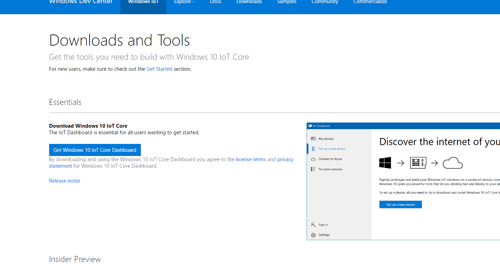
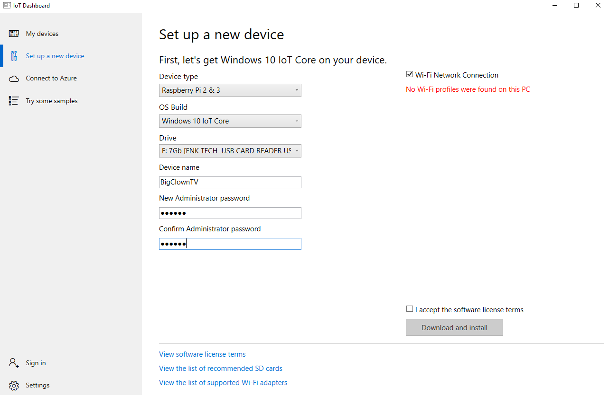
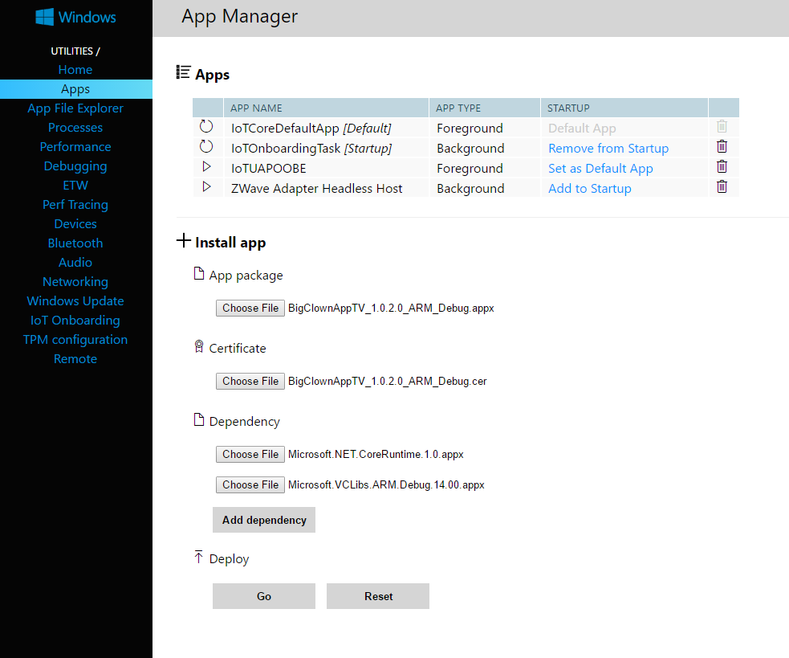

# UWP BigClownTV
Tento projekt Vás provede krok po kroku instalací, konfigurací a modifikování projektu **UWP BigClownTV**.
Projekt je primárně určen a testován na Raspberry Pi 3 (Model B), ale projekt by měl fungovat i na všech zařízeních s Windows 10 a víš.

Aplikace se stále nachází ve vývojové fázi, takže je pravděpodobnost, že některé funkce nebudou k dispozici nebo dokonce se ztratí některá uložená data.

> **Note** UWP znamená Universal Windows Platform.

Aplikace BigClownTV je určena ke grafickému zobrazování dat na TV nebo monitor.

>**Note** Aplikace je šířena pod **MLA licencí**.
Aplikace nemůže být zpoplatněna.

## Požadavky
* Raspberry Pi 3 (model B)
* TV nebo monitor (doporučené rozlišení 1920x1080)
* Minimálně 4 GiB MicroSD card
* MicroSD čtečku
* Ethernet kabel
* Notebook nebo osobní PC
* Router s configurovaným DHCP serverem
* Operační systém Windows 10
* Bridge projekt nebo Workroom projekt

> **Note** Momentálně jsou podporovány následující senzory: Barometer Tag, Humidity Tag, Lux Meter Tag, Temperature Tag.

## Instalace a spuštění
Vyberte si jestli chcete použít BigClown IoT core nebo Windows IoT Core.

### BigClown IoT core image
*Již brzy*

### Windows IoT core image & UWP BigClownTV
Pokud již máte nainstalovaný IoT Core, to přeskočte to k bodu *2.2.2*.

### Instalace IoT Core
1. Jděte na stránku [Microsoftu](https://developer.microsoft.com/en-us/windows/iot/downloads) a klikněte na **Get Windows 10 IoT Core Dashboard** a stáhněte.

2. Připojte formátovanou SD kartu do PC.
3. Nainstalujte a otevřete **Windows 10 IoT Core Dashboard**
4. Zvolte záložku *Set up a new device*.
5. Device type zvolte **Raspberry Pi 2 &3**, OS build **Windows IoT Core** dále jako *Drive* zvolte Vaši SD kartu.
*Device name* a *Administrator password* si zvolte sami.
Dále máte možnost si předkonfigurovat Wifi připojení, aby se Vám Raspberry připojilo automaticky k internetu.
6. Klikněte na **Donwload and install** a vyčkejte.

7. Vložte SD kartu do Raspberry a strčte napájecí kabel.
8. **Hotovo!**

### Instalace UWP BigClownTV
1. Otevřete **Windows 10 IoT Core IoT Dashboard** 
2. V záložce *My devices* byjste měli vidět Vaše Raspberry

3. Klikněte na vaše zařízení pravým tlačítkem a zvolte *Open in Device Portal*.
To Váš přesměruje do prohlížeče, kde vyplňte své heslo co jste nastavili při nahrávání OS na SD kartu a jméno ze začátku je *administrator*.
4. Po uspěšném přihlášení na webový server Raspberry Pi, zvolte záložku *Apps*.
Zde jdou vidět běžíci aplikace na Raspberry Pi.
5. Stáhněte si aplikaci [BigClownTV](http://Musimdodatodkaz.specha).
6. V záložce *Apps* nahrajte aplikaci.
**App package** zvolte *BigClownTV_x.x.x.x_ARM_Debug.appx*, stažený ze souboru.
**Certificate** zvolte *BigClownTV_x.x.x.x_ARM_Debug.cer*, stažený ze souboru.
**Dependency** zvolte *Microsoft.NET.CoreRuntime.1.0.appx* a *Microsoft.VCLibs.ARM.Debug.14.00.appx*, stažený ze souboru.

> **Note** Místo x.x.x.x je vždy nějaké číslo verze např. 1.0.2.0.

7. Zmáčkněte tlačítko **Go** a aplikace by se měla začít nahrávat na Raspberry Pi.

8. Nyní by aplikace **BigClown** měla být vidět mezi ostatními. 
Po té co zaškrtnete *Set as Default App* bude se aplikace spouštět při startu Raspberry Pi jako hlavní.
9. **Hotovo**

## Užívání
Po zapnutí aplikace by se Vám měl načíct graf s ovládacím panelem po levé straně.

>**Note** Některé televize nebo PC mají nastavený tzv. *scale* obrazu, takže ho musíte vypnout, aby šlo vidět postraní menu.

Aby se Vám do aplikace dostávaly data musíte se připojit na Vašeho **Brokera**.
Toho dosáhnete následovně:

1. Klikněte na ozubené kolečko na levé straně obrazovky aplikace.

>**Note** Musíte mít připojenou klávesnici a myš k Raspberry Pi nebo přes vzdálenou plochu.

2. Do položky *IP* zadejte IP Vašeho **Brokera** nebo hostname *hub.local*

>**Tip** Je lepší použít IP, protože hostname né vždy funguje.

3. Měli by Vám začít chodit data do grafu.

## Struktura aplikace

### Programová část
Aplikace je založena na návrhovém modelu MVVM, což od sebe odděluje prvky kvůli přehlednosti.

> **Note** MVVM znamená Model-View-Viewmodel

Stručně a jasně ve *View* se nachází prvky co souvisí s tím co se dá zobrazovat.
V *Modelu* se nachází logické funkční prvky co vykonávají nějakou programovou logiku (MQTT klient, databáze).

### Funkční část
Aplikace po zapnutí si načte do grafu všechny data z databáze za posledních 7.
Poté je jednotlivě promíta v učitém časovém intervalu.
Po připojení na **Brokera** přes MQTT klienta aplikace to začne všechna nová data zapisovat do databáze a následně do grafů.
Pokud nějaká data v grafu jsou starší jak 7 dní, tak je to z grafu smaže.

